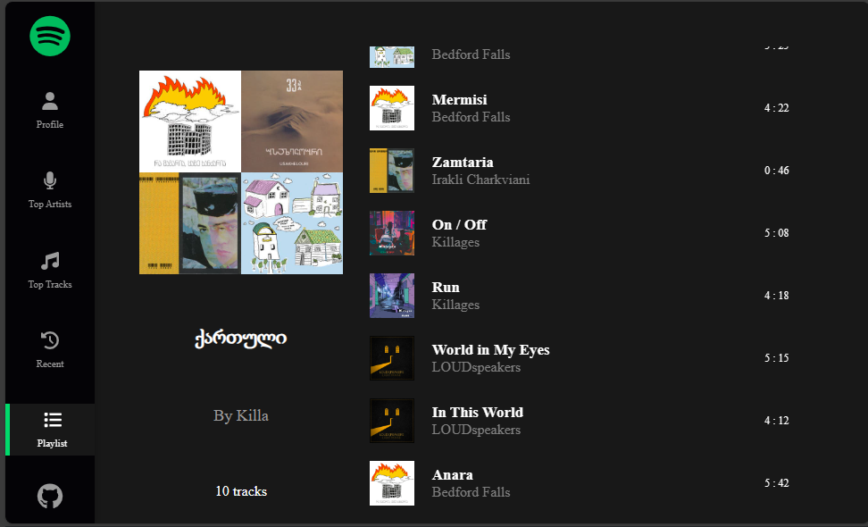

# React + TypeScript + Vite

spotify-app-kila21.vercel.app - deployed website link.

## Right now, Auto Development Mode. It means that if my app have no email added to spotify dashboard. user cant visit website to see their profie. for more information visit: https://developer.spotify.com/documentation/web-api/concepts/quota-modes

### email: irvingkyrie2001@gmail.com

### pass: Araferigansakutrebuli200121

#### that's testing account. which u can use untile spotify accept my extension request;

